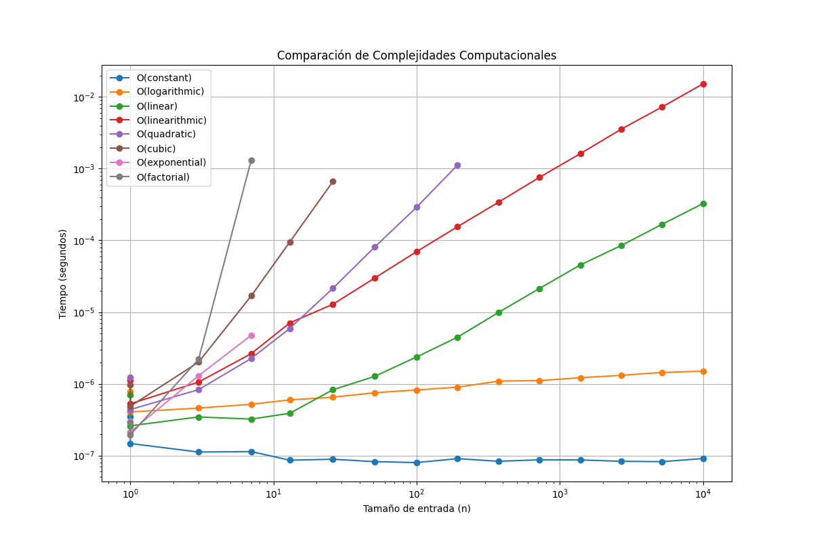

# Visualización de Complejidad Computacional

## ¿Qué es la Complejidad Computacional?

La complejidad computacional es una medida que nos permite evaluar la eficiencia de un algoritmo en términos de:
- Tiempo de ejecución (complejidad temporal)
- Memoria utilizada (complejidad espacial)

En este proyecto nos enfocamos en la complejidad temporal, que describe cómo crece el tiempo de ejecución de un algoritmo en relación al tamaño de entrada (n).

### Clases de Complejidad Implementadas



Como se puede observar en el gráfico, implementamos las siguientes complejidades:
- O(1): Tiempo constante - El mejor caso
- O(log n): Crecimiento logarítmico - Muy eficiente
- O(n): Crecimiento lineal - Eficiente
- O(n log n): Crecimiento lineal-logarítmico - Bastante práctico
- O(n²): Crecimiento cuadrático - Puede ser problemático con entradas grandes
- O(n³): Crecimiento cúbico - Problemático para entradas medianas
- O(2ⁿ): Crecimiento exponencial - Práctico solo para entradas muy pequeñas
- O(n!): Crecimiento factorial - El peor caso

## Requisitos

- Python 3.6 o superior
- Paquetes requeridos:
  - numpy >= 1.20.0
  - matplotlib >= 3.4.0

## Instalación

1. Clonar este repositorio:
```bash
git clone https://github.com/stevenvo780/ComplejidadYCostoComputacional
cd ComplejidadYCostoComputacional
```

2. Crear y activar un entorno virtual (recomendado):
```bash
python -m venv .venv
source .venv/bin/activate  # En Windows usar: .venv\Scripts\activate
```

3. Instalar dependencias:
```bash
pip install -r requirements.txt
```

## Uso

Ejecutar el script principal:
```bash
python main.py
```

El script realizará:
1. La ejecución de algoritmos de diferentes clases de complejidad
2. La medición de sus tiempos de ejecución para varios tamaños de entrada
3. La generación de un gráfico en escala logarítmica comparando su rendimiento

## Funcionamiento

- Cada clase de complejidad está implementada en un módulo separado bajo el directorio `complexities/`
- El script principal mide el tiempo de ejecución de cada algoritmo con diferentes tamaños de entrada
- Los tamaños de entrada se ajustan automáticamente para algoritmos más complejos
- Los resultados se grafican en escala logarítmica para una visualización clara

## Nota

Las complejidades exponencial y factorial están limitadas a tamaños de entrada más pequeños debido a su naturaleza computacionalmente intensiva. El programa ajusta automáticamente el tamaño máximo de entrada para estos algoritmos para evitar tiempos de ejecución excesivos.

## Por: Stev
